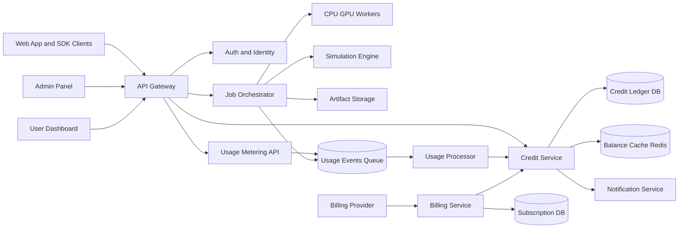

# Cloud Credit System: End-to-End Architecture

## Step 2. Credit system design

### Core design goals

- One unified credit ledger for all billable resources
- Atomic, auditable, reversible transactions
- Real-time balance checks for pre-flight validation
- Team and user-level budget enforcement
- Support free and paid credits with expiry rules

### Credit buckets

- Trial credits: granted at signup, shortest expiry, lowest priority usage
- Subscription credits: recurring monthly allocation, medium priority usage
- Top-up credits: purchased separately, longest expiry, consumed last or configurable
- Promo/manual credits: admin grants with explicit reason and expiry

### Consumption order policy (default)

1. Expiring soonest credits first
2. Trial before paid (or configurable by plan)
3. Bucket priority fallback if same expiry

### Refund policy

- Full refund for jobs that fail before workload starts
- Partial refund for partially executed jobs
- No refund for successful completed workload
- Refunds are separate ledger entries, never balance overwrites

## Step 3. Credit consumption model

### Metering units

- API usage: per 1K requests and optional per 1M tokens
- CPU jobs: per vCPU-second
- GPU jobs: per GPU-second by class (T4, A10, A100, etc.)
- Simulations: base charge + duration + memory multiplier
- Storage: GB-hour for hot, lower multiplier for archive
- Premium features: fixed per execution or per user/month

### Dynamic price model

Credit cost formula:

cost_credits = base + (unit_count * unit_rate * region_multiplier * priority_multiplier * plan_discount)

Example:

- base: 0.2 credits per job
- unit_rate: 0.0012 credits per vCPU-second
- region_multiplier: 1.1
- priority_multiplier: 1.25 for high priority queue
- plan_discount: 0.85 for enterprise contract

### Cost estimate behavior

- Estimate endpoint returns low/avg/high projected cost
- Client shows estimate before run
- Execution reserves max estimate, settles to actual on completion

## Step 5. Secure transaction system

### Transaction lifecycle

1. Reserve credits at job admission
2. Lock balance rows and write reservation ledger event
3. Run workload asynchronously
4. Finalize actual charge and release unused reservation
5. Write immutable audit and usage events

### Concurrency and atomicity

- Use DB transaction with SERIALIZABLE or REPEATABLE READ where required
- Use row-level locking on balance rows: SELECT ... FOR UPDATE
- Enforce idempotency keys for all debit/refund operations
- Use unique constraints on external reference IDs

### Fraud and abuse protection

- Velocity limits by API key, user, org, IP
- Anomaly scoring on unusual consumption bursts
- Soft/hard thresholds with auto-throttle and kill-switch
- Separate approval queue for large manual adjustments

## Step 8. Usage monitoring model

### Real-time streams and aggregates

- Stream usage events to queue (Kafka/SQS/PubSub equivalent)
- Materialize 1m, 5m, 1h aggregates by org, workspace, user, resource
- Alert on budget threshold breach (50%, 80%, 95%, 100%)

### Key operational metrics

- Credits consumed per minute
- Reservation backlog and settlement latency
- Failed transaction ratio
- Heavy users and high-cost workspaces
- Queue depth and worker saturation

## Step 9. Scalability and reliability

### Distributed architecture

- API Gateway + Auth service
- Credit service (ledger + balance + rules engine)
- Metering service (usage ingestion and normalization)
- Job orchestrator (compute/simulation execution)
- Billing service (plans, invoices, subscription sync)
- Notification service (alerts, low-credit warnings)

### Queue and throttling

- Multi-queue by priority and workload type
- Token bucket rate limits at API key and org scope
- Dynamic throttling when credits low or unpaid state

### Reliability controls

- Outbox pattern for reliable event publishing
- Retry with idempotency protection
- Dead-letter queues for failed processing
- Regional failover for ledger read API

## Step 10. Final architecture

## Service breakdown

- Credit Service
- Responsibilities: balance checks, reservation, debit, refund, expiry sweeps
- Storage: credit_balances, credit_transactions, credit_holds

- Metering Service
- Responsibilities: usage event ingestion, normalization, unit conversion
- Storage: usage_logs, usage_aggregates

- Billing Service
- Responsibilities: plan catalog, subscription lifecycle, invoice webhooks, top-ups
- Storage: billing_plans, subscriptions, invoices

- Job Orchestrator
- Responsibilities: queueing, scheduling, retries, completion callbacks, cancellation
- Storage: job_executions, job_cost_breakdown

## Step 6. Admin panel controls

- Grant credits with reason, expiry, and scope
- Revoke or freeze credit buckets
- Manual adjustments with dual-approval option
- Configure pricing tables and multipliers
- Monitor heavy users and abuse patterns
- View immutable ledger and transaction traces
- Export finance and usage reports

## Step 7. User dashboard features

- Current available credits and bucket breakdown
- Time-to-expiry view by bucket
- Usage history by project/workspace/resource
- Cost estimate before workload submission
- Budget caps and alerts configuration
- Subscription plan details and upcoming renewal

## User credit workflow

1. User submits job or API request
2. Platform estimates cost
3. Credit Service reserves credits
4. Workload runs
5. Metering sends actual usage
6. Credit Service settles charge and refunds remainder
7. Dashboard and admin reports update in near real time
